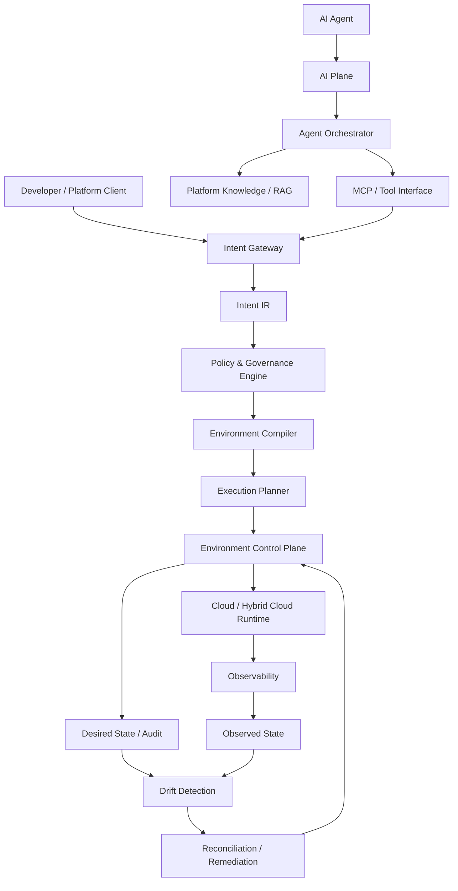

# AI-Native Self-Managing X-Cloud Platform

An AI-native control plane for translating high-level software and infrastructure intent into governed, deployable, and self-managing cloud environments.

## Problem

Modern engineering platforms expose developers to a growing set of infrastructure, security, networking, identity, compliance, and operational decisions.

This creates friction between:

- What a developer wants to build
- What the platform allows
- How that intent is translated into infrastructure
- How the resulting environment is operated and maintained

This project explores a control-plane architecture that reduces that gap while keeping security, governance, and execution deterministic.

## Vision

A developer, platform engineer, or AI agent should be able to express an environment in terms of intent:

> "Create a production Java service in Germany with private networking, restricted egress, encrypted PII data, multi-zone availability, monitoring, and rollback support."

The platform translates that intent into a structured representation, validates it against policy, produces an execution plan, and manages the resulting environment lifecycle.

## Architecture



## Core Design Principles

### 1. AI reasons about intent; deterministic systems execute infrastructure

LLMs and agents are useful for interpreting requests, retrieving knowledge, analyzing failures, and proposing actions.

They are not treated as the final authority for privileged infrastructure execution.

### 2. Policy is evaluated before privileged execution

Security, compliance, residency, networking, budget, and operational constraints are represented as explicit policies.

A requested environment must pass policy evaluation before execution can proceed.

### 3. Structured intent is the platform contract

Natural language is an input format, not the execution contract.

The platform converts natural-language requests into a structured intermediate representation that can be validated, planned, audited, and compiled independently of the underlying AI model.

### 4. Control plane and workload/data plane remain separate

The control plane owns intent, policy, planning, lifecycle, state, and reconciliation.

The workload/data plane contains the actual applications, infrastructure, and managed services.

### 5. Agent authority is bounded

AI agents interact with controlled platform interfaces and operate within explicitly scoped permissions.

An agent cannot use the platform to grant itself broader authority.

### 6. Desired state and observed state are explicit

The platform maintains a representation of what an environment should look like and what it actually looks like.

The difference between the two becomes the basis for drift detection and reconciliation.

## Intent to Environment

The platform follows an explicit lifecycle:

```text
Natural-language intent
        |
        v
Intent extraction
        |
        v
Structured Intent IR
        |
        v
Semantic validation
        |
        v
Policy evaluation
        |
        v
Dependency resolution
        |
        v
Environment plan
        |
        v
Execution
        |
        v
Runtime observation
        |
        v
Drift detection
        |
        v
Reconciliation
```
The separation between these stages is intentional.

The AI layer may help construct or interpret intent, while deterministic control-plane components own validation, authorization, planning, and execution.

## Example

A request such as:

```text
Create a production Java 21 service in Germany.
Use private networking, restricted egress, encrypted PII storage,
multi-zone availability, monitoring, and rollback support.
```
is transformed into a structured environment specification:

```yaml
service:
  name: application-service
  runtime: java21

environment:
  tier: production
  region: germany

network:
  private: true
  egress: restricted

data:
  classification: pii
  encryption: required

availability:
  zones: 3

operations:
  monitoring: required
  rollback: enabled
```
The structured specification is then evaluated against platform policies and converted into an executable environment plan.

## AI and Agent Model

AI agents are treated as platform clients rather than privileged infrastructure executors.

Agents may:

- Interpret natural-language requests
- Retrieve platform knowledge
- Construct structured intent
- Inspect environment state
- Request environment plans
- Analyze operational failures
- Propose remediation actions
- Assist with application development workflows

Privileged operations remain behind authenticated, authorized, policy-controlled platform interfaces.

This allows the AI layer and the infrastructure control plane to evolve independently.

## Self-Management

The platform is designed around a reconciliation loop:

```text
Desired State
      |
      v
Observed State
      |
      v
Drift / Difference
      |
      v
Policy Evaluation
      |
      v
Reconciliation Plan
      |
      v
Execution
      |
      v
Observed State
```
The same control-plane boundaries used during initial provisioning are reused during lifecycle management and remediation.

## Multi-Cloud Model

The intent model remains provider-neutral:

```text
Intent IR
    ↓
Environment Plan
    ↓
┌──────────┬──────────┬──────────┐
│   AWS    │   GCP    │  Azure   │
│ Adapter  │ Adapter  │ Adapter  │
└──────────┴──────────┴──────────┘
```
Provider-specific configuration and execution are isolated behind cloud adapters rather than exposed through the user-facing intent model.

## Security Model

Security is treated as an architectural property rather than an implementation detail.

Key principles include:

- Explicit identity and authorization
- Policy evaluation before privileged execution
- Short-lived, scoped credentials
- Bounded agent permissions
- No agent self-escalation
- Full auditability of privileged actions
- Fail-closed behavior for security-sensitive operations
- Human approval for actions that require it

The AI layer does not receive unrestricted cloud credentials. Privileged operations are performed through controlled interfaces governed by the control plane.

## Engineering Focus

This project explores:

- Intent-driven infrastructure management
- AI agent orchestration
- MCP-based platform interaction
- Policy and governance
- Control-plane architecture
- Cloud environment compilation
- Infrastructure execution planning
- Multi-cloud abstraction
- Observability
- Drift detection
- Reconciliation and remediation
- Developer productivity
- Self-managing software workflows

## Project Status

### Phase 1

Architecture, domain model, security model, and architectural decisions

### Phase 2

Intent representation, validation, policy engine, and environment compiler

### Phase 3

Execution planner, lifecycle management, and cloud/provider adapters

### Phase 4

MCP interfaces and agent orchestration

### Phase 5

Observability, drift detection, and remediation

### Phase 6

Developer productivity and self-maintaining codebase capabilities

### Phase 7

Evaluation, failure testing, security hardening, and production-oriented optimization

## Repository Structure

```text
.
├── src/
├── docs/
│   ├── architecture.md
│   ├── domain-model.md
│   ├── security-model.md
│   └── adr/
└── README.md
```
The `docs` directory contains the architecture model, domain definitions, security boundaries, and key architectural decisions. Implementation is introduced incrementally against these contracts.

## Design Goal

Build a strongly governed AI-native engineering platform that translates software and infrastructure intent into deployable, observable, and self-managing cloud environments.