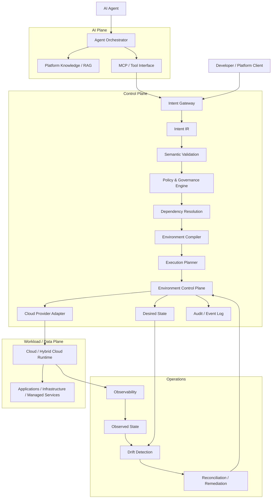

# Architecture

## Purpose

This document defines the architecture of the AI-Native Self-Managing X-Cloud Platform.

The architecture separates AI-driven reasoning from deterministic infrastructure control while providing a provider-neutral model for expressing, validating, planning, executing, observing, and reconciling software and infrastructure environments.

The design is intended to support both direct platform clients and AI agents without coupling the platform contract to a specific AI model, cloud provider, or infrastructure implementation.

## Architectural Goals

The platform is designed around the following goals:

1. Translate high-level software and infrastructure intent into structured environment plans and ordered execution plans.
2. Keep authorization, policy evaluation, and privileged execution deterministic.
3. Provide a stable platform contract independent of AI model and cloud provider.
4. Support continuous lifecycle management through desired-state and observed-state reconciliation.
5. Bound AI agent authority through explicit interfaces and scoped permissions.
6. Isolate provider-specific infrastructure details behind cloud adapters.
7. Provide traceability from requested intent through policy decisions, execution, and runtime state.

## High-Level Architecture



## Architectural Planes

The platform is divided into distinct planes with different responsibilities and trust characteristics.

### AI Plane

The AI Plane provides reasoning and interpretation capabilities.

Responsibilities include:

- Interpreting natural-language requests
- Retrieving platform knowledge
- Constructing structured intent
- Inspecting platform state through controlled tools
- Analyzing operational failures
- Proposing remediation actions
- Supporting developer workflows

The AI Plane does not own infrastructure authorization or privileged execution.

### Control Plane

The Control Plane is the authoritative system of record for the managed environment lifecycle.

Responsibilities include:

- Accepting structured intent
- Validating intent
- Evaluating policy
- Resolving dependencies
- Compiling provider-neutral intent into environment plans
- Planning changes
- Authorizing execution
- Managing desired state
- Tracking lifecycle state
- Maintaining audit records
- Performing reconciliation

The Control Plane is responsible for enforcing the platform's architectural and security invariants.

### Workload / Data Plane

The Workload / Data Plane contains the resources being managed.

Examples include:

- Application workloads
- Compute resources
- Networking
- Storage
- Databases
- Messaging systems
- Managed cloud services

The Workload / Data Plane does not define platform policy or interpret natural-language intent.

### Operations Plane

Operational capabilities provide visibility into runtime state and lifecycle behavior.

Responsibilities include:

- Metrics
- Logs
- Traces
- Health signals
- Runtime inventory
- Drift detection
- Reconciliation triggers
- Operational events and signals

Operational information feeds the lifecycle control loop rather than creating an independent execution path.

## Core Architectural Boundary

The central architectural boundary is:

```text
AI reasoning
     |
     v
Structured Intent
     |
     v
Deterministic Control Plane
     |
     v
Authorized Execution
     |
     v
Runtime State
```

The AI layer can interpret, analyze, and propose.

The Control Plane validates, authorizes, plans, and executes.

This separation allows the AI implementation to evolve independently from infrastructure control and prevents model-specific behavior from becoming the execution contract.

## Request Lifecycle

A requested environment follows an explicit lifecycle. Once structured intent is constructed, the control-plane stages are deterministic. For natural-language requests, intent is extracted before entering the deterministic control-plane lifecycle. Direct platform clients and AI agents may enter through the gateway with structured intent already constructed.

```text
Natural-language intent
        |
        v
Intent extraction
        |
        v
Structured Intent IR
        |
        v
Semantic validation
        |
        v
Policy evaluation
        |
        v
Dependency resolution
        |
        v
Environment compilation
        |
        v
Proposed desired state
        |
        v
Execution planning
        |
        v
Approval, when required
        |
        v
Desired state
        |
        v
Authorized execution
        |
        v
Runtime observation
        |
        v
Observed state
```

The lifecycle is intentionally divided into stages so that each stage has a clear responsibility and independently testable contract.

## Intent Gateway

The Intent Gateway is the entry point into the deterministic platform.

It accepts structured intent from:

- Developer or platform clients
- AI agents through MCP
- Future automation systems

Direct platform clients submit structured intent to the gateway. AI agents use the AI Plane to interpret natural-language requests and construct structured intent before invoking the gateway.

The gateway is responsible for:

- Authentication
- Protocol and schema validation
- Request normalization
- Correlation and request identity
- Passing valid requests into the Intent processing pipeline

The gateway does not directly execute infrastructure actions. Semantic correctness is evaluated by the validation stage after the request has been normalized into the platform processing model.

## Intent Intermediate Representation

The Intent IR is the platform's provider-neutral representation of the requested environment.

The IR separates what the requester wants from how a specific provider implements it.

Conceptually:

```text
Requester Intent
       |
       v
Intent IR
       |
       v
Semantic Validation
       |
       v
Policy Evaluation
       |
       v
Dependency Resolution
       |
       v
Environment Compiler
       |
       v
Provider-neutral Environment Plan
```

The IR should represent platform-level concepts such as:

- Application identity
- Runtime requirements
- Environment tier
- Region or residency constraints
- Network requirements
- Data classification
- Availability requirements
- Security requirements
- Observability requirements
- Lifecycle requirements
- Cost or operational constraints

Provider-specific configuration should not become part of the user-facing contract unless the platform explicitly exposes it as a supported capability.

## Semantic Validation

Semantic validation determines whether an intent is structurally and logically meaningful before policy evaluation and execution planning.

Examples include:

- Required fields are present
- Runtime requirements are internally consistent
- Environment constraints do not conflict
- Availability requirements are representable
- Referenced capabilities exist
- Dependencies can be resolved

Semantic validation is separate from policy evaluation.

A request may be technically valid but still violate an organizational policy.

## Policy and Governance

The Policy and Governance Engine evaluates the requested environment against explicit constraints.

Policies may address:

- Security
- Data residency
- Compliance
- Networking
- Identity
- Budget
- Availability
- Operational requirements

The policy decision becomes part of the request's auditable lifecycle.

Conceptually:

```text
Intent IR
    |
    v
Policy Evaluation
    |
    +----> Deny
    |
    +----> Allow
    |
    +----> Allow with Constraints
```

Privileged execution does not proceed when required policy conditions are not satisfied.

## Dependency Resolution

A valid intent may reference capabilities that require additional resources or ordering constraints.

Dependency resolution determines:

- Required platform capabilities
- Capability and resource dependencies
- Cross-resource relationships
- Preconditions
- Dependency graph

The resulting dependency graph becomes an input to environment compilation and execution planning.

## Environment Compiler

The Environment Compiler transforms provider-neutral intent into a provider-neutral environment plan that is consumed by the Execution Planner and ultimately translated into provider-specific execution through cloud adapters.

Conceptually:

```text
Intent IR
    |
    v
Environment Compiler
    |
    v
Provider-neutral Environment Plan
```

The compiler isolates provider-specific implementation details from the Intent IR. The resulting provider-neutral environment plan is consumed by the Execution Planner before reaching the Environment Control Plane and cloud-specific adapters.

This provides:

- Provider abstraction
- Consistent platform semantics
- Independent adapter evolution
- Easier testing
- Reduced coupling between users and cloud-provider APIs

## Execution Planner

The Execution Planner converts a provider-neutral environment plan into an ordered execution plan.

A plan should make explicit:

- What resources will be created
- What resources will be changed
- What resources will be removed
- Required dependencies
- Preconditions
- Ordering constraints
- Policy constraints
- Expected resulting state

Planning is distinct from execution.

This allows the platform to inspect, validate, audit, and potentially approve a proposed execution plan before privileged operations occur. Where required by policy or environment risk, an execution plan must be approved before the Control Plane accepts it for privileged execution.

## Environment Control Plane

The Environment Control Plane is the lifecycle-execution component within the broader Control Plane. It owns environment state transitions and coordinates approved infrastructure changes.

Responsibilities include:

- Accepting approved execution plans
- Coordinating execution
- Tracking operation state
- Maintaining desired state
- Recording execution results
- Handling partial failures
- Triggering reconciliation when required

The Control Plane remains the authoritative execution boundary for managed infrastructure.

## Desired State and Observed State

The platform maintains two distinct representations.

### Desired State

Desired State describes the environment that the platform intends to maintain.

It is derived from:

- Approved Intent IR
- Applicable policy decisions
- Environment Plan
- Explicit lifecycle changes

When approval is required, the desired state becomes authoritative only after the corresponding execution plan satisfies the required approval conditions.

### Observed State

Observed State describes what currently exists in the runtime environment.

It is derived from:

- Runtime inventory
- Cloud provider APIs
- Application health
- Infrastructure telemetry
- Operational signals

The two states should not be conflated.

```text
Desired State --------------------+
                                   |
                                   v
                              Difference
                                   ^
                                   |
Observed State --------------------+
```

The difference between the two states is the basis for drift detection and reconciliation.

## Reconciliation

The platform uses reconciliation to continuously converge runtime state toward approved desired state.

```text
Desired State -----------+
                         |
                         v
                   Drift Detection
                         ^
                         |
Observed State ----------+
                         |
                         v
                  Policy Evaluation
                         |
                         v
                 Reconciliation Plan
                         |
                         v
                  Authorized Execution
                         |
                         v
                  Observed State
```

Reconciliation uses the same control-plane boundaries as initial provisioning.

This is important because remediation must pass the applicable validation, authorization, policy, and audit controls before privileged execution, without creating a separate execution path around the Control Plane.

## AI Agent Interaction Model

AI agents interact with the platform through explicit tools and interfaces.

A typical flow is:

```text
AI Agent
    |
    v
Agent Orchestrator
    |
    v
MCP / Tool Interface
    |
    v
Intent Gateway
    |
    v
Control Plane
```

Agents may:

- Construct intent
- Query platform knowledge
- Inspect environment state
- Request plans
- Analyze failures
- Propose remediation

Agents do not acquire broader authority by changing their own requests or tool configuration.

The platform remains responsible for authentication, authorization, policy evaluation, execution planning, and privileged operations.

## MCP Boundary

MCP provides a controlled interface between AI agents and platform capabilities.

The interface should expose explicit platform operations rather than unrestricted infrastructure credentials.

Examples of conceptual tool categories include:

```text
read_intent
validate_intent
evaluate_policy
get_environment
generate_plan
inspect_runtime
propose_remediation
```

Privileged execution should remain behind the Control Plane rather than being exposed as unrestricted provider operations.

## Multi-Cloud Architecture

The platform uses provider-neutral intent and plans with cloud-specific adapters at the execution boundary.

```text
                    Intent IR
                       |
                       v
              Environment Compiler
                       |
                       v
          Provider-neutral Environment Plan
                       |
                       v
                Execution Planner
                       |
                       v
                 Execution Plan
                       |
                       v
                Environment Control
                       |
          +------------+------------+
          |            |            |
          v            v            v
       AWS Adapter  GCP Adapter  Azure Adapter
          |            |            |
          v            v            v
       Provider APIs / Infrastructure
```

Each adapter translates the platform's execution plan into provider-specific execution semantics.

Provider capabilities that cannot be represented uniformly should be handled as explicit platform capabilities rather than silently leaking provider-specific assumptions into the Intent IR.

## Security and Trust Boundaries

The primary trust boundaries are:

```text
+----------------------+
| AI Plane             |
| Probabilistic        |
| Reasoning            |
+----------+-----------+
           |
           | Controlled Interface
           v
+----------------------+
| Control Plane        |
| Validation           |
| Authorization        |
| Policy               |
| Planning             |
| Execution            |
+----------+-----------+
           |
           | Provider Adapter
           v
+----------------------+
| Workload / Data Plane|
| Managed Environment  |
+----------------------+
```

The following principles apply across the boundaries:

- Identity is explicit
- Authorization is enforced by deterministic platform components
- Agent permissions are scoped
- Privileged operations require controlled interfaces
- Provider credentials are not exposed directly to the AI layer
- Security-sensitive failures should fail closed
- Privileged actions are auditable

## Failure Handling

Failure behavior is part of the architecture rather than an implementation detail.

Examples include:

### Invalid Intent

The request is rejected before planning.

```text
Intent
  |
  v
Validation
  |
  +----> Invalid
           |
           v
         Reject
```

### Policy Denial

The request is structurally valid but violates policy.

```text
Intent
  |
  v
Policy
  |
  +----> Deny
           |
           v
      No Execution
```

### Compilation or Planning Failure

The platform cannot construct a valid environment plan or execution plan.

```text
Intent
  |
  v
Planning
  |
  +----> Failure
           |
           v
      No Execution
```

### Partial Execution Failure

A multi-step change may partially succeed.

The Control Plane must preserve operation state and record the failure. Recovery is determined by operation semantics: retry when the operation is safely retryable and the failure is transient, use rollback or compensating actions only when explicitly supported, and otherwise reconcile the environment toward the approved desired state.

### Runtime Drift

The environment may diverge from desired state due to external changes or infrastructure failure.

Drift should trigger the reconciliation lifecycle rather than bypassing policy and authorization controls.

## Observability and Audit

Every significant lifecycle transition should be traceable.

The architecture should provide correlation across:

```text
Request
  |
  v
Intent
  |
  v
Policy Decision
  |
  v
Environment Plan
  |
  v
Execution
  |
  v
Runtime State
  |
  v
Reconciliation
```

Relevant operational records include:

- Request identity
- Intent version
- Policy decision
- Plan version
- Execution status
- Resource changes
- Runtime observations
- Reconciliation actions
- Failure information

This provides the basis for operational debugging, governance, and auditability. Audit records are append-only lifecycle records and are not used as the source of desired or observed state.

## Architectural Invariants

The following invariants define important properties of the system.

### Invariant 1

AI-generated output is never the sole authorization for privileged infrastructure execution.

### Invariant 2

All privileged infrastructure operations pass through the deterministic Control Plane.

### Invariant 3

The Intent IR remains independent of a specific AI model.

### Invariant 4

The Intent IR remains independent of a specific cloud provider.

### Invariant 5

Policy evaluation occurs before privileged execution.

### Invariant 6

Agent permissions are explicitly scoped and cannot be expanded by the agent itself.

### Invariant 7

Desired state and observed state remain distinct.

### Invariant 8

Reconciliation uses the same authorization and policy boundaries as initial provisioning.

## Extensibility

The architecture is designed so that major subsystems can evolve independently.

Examples include:

```text
AI Model
    |
    +---- Model A
    +---- Model B
    +---- Model C

Cloud Provider
    |
    +---- AWS
    +---- GCP
    +---- Azure

Agent Interface
    |
    +---- MCP
    +---- Platform API
    +---- Automation Client

Policy Engine
    |
    +---- Security Policies
    +---- Residency Policies
    +---- Cost Policies
    +---- Operational Policies
```

The platform contracts should remain stable while implementations evolve behind those boundaries.

## Architectural Evolution

The architecture is expected to evolve incrementally.

The initial implementation sequence is:

```text
Architecture Contracts
        |
        v
Intent Representation
        |
        v
Validation and Policy
        |
        v
Environment Compilation
        |
        v
Execution Planning
        |
        v
Lifecycle Management
        |
        v
AI / MCP Integration
        |
        v
Observability and Reconciliation
```

Each stage should build on previously established contracts rather than bypassing them.

## Phase 1 Scope

Phase 1 focuses on architecture and contracts rather than production-scale implementation.

The primary outputs are:

- Architecture model
- Domain model
- Security model
- Architectural decision records
- Initial platform contracts

Implementation should be introduced incrementally against these artifacts.

## Summary

The platform is organized around a simple architectural principle:

```text
AI interprets intent.
Control Plane governs and executes.
Runtime provides the environment.
Observability provides runtime signals.
Reconciliation maintains convergence.
```

The resulting architecture provides a foundation for AI-assisted engineering, governed infrastructure management, multi-cloud abstraction, and self-managing environments while keeping system authority explicit and deterministic.